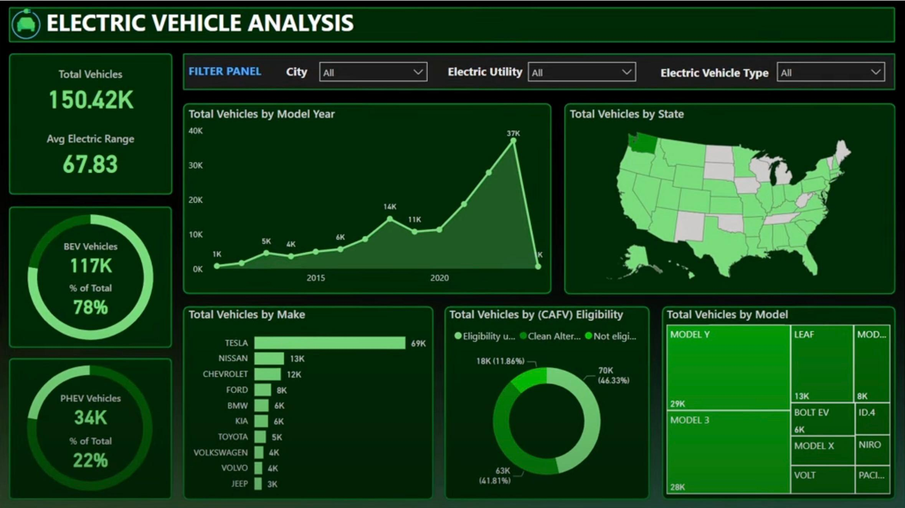

# Electric Vehicle Analysis Dashboard

## Overview
This **Electric Vehicle Analysis Dashboard** provides insights into the adoption and distribution of electric vehicles (EVs) across various parameters. The dashboard is designed for data visualization, helping users understand trends in electric vehicle usage, manufacturer share, model distribution, and state-wise adoption.

## Features
- **Total Vehicles**: Displays the total number of electric vehicles along with the average electric range.
- **Vehicle Type Distribution**:
  - **BEV (Battery Electric Vehicles)**: Represents the percentage and count of pure electric vehicles.
  - **PHEV (Plug-in Hybrid Electric Vehicles)**: Shows the proportion of hybrid vehicles.
- **Total Vehicles by Model Year**: A trend line graph representing the number of EVs registered by year.
- **Total Vehicles by State**: A heat map of the United States highlighting EV distribution across different states.
- **Total Vehicles by Make**: A horizontal bar chart showing the count of EVs by manufacturer *(Tesla, Nissan, Chevrolet, etc.).*
- **Total Vehicles by (CAFV) Eligibility**: A donut chart classifying EVs based on their eligibility for clean alternative fuel vehicle programs.
- **Total Vehicles by Model**: A list of popular EV models along with their total count.
- **Filter Panel**: Users can filter data by **city, electric utility, and electric vehicle type**.

## Data Sources
The data used in this dashboard is sourced from **electric vehicle registration databases** and may include information from government and private sector reports.

## Usage
This dashboard is useful for:
- 🏛 **Government agencies** monitoring EV adoption.
- 🚗 **Automobile manufacturers** analyzing market share.
- 📊 **Researchers** studying EV trends.
- 🔍 **Consumers** looking for insights into the EV market.

## Technologies Used
- **Data Visualization**: The dashboard is designed using data visualization tools such as *Power BI or Tableau*.
- **Data Processing**: Data is processed using *Python, SQL, or other analytics tools*.
- **Dashboard Styling**: Dark theme with green highlights to enhance readability and presentation.

## Future Enhancements
- ✅ Integration with **real-time EV registration databases**.
- 🔮 Predictive analytics for **future EV adoption trends**.
- 🛠 More granular filtering options *(e.g., price range, battery capacity)*.
- 📊 Interactive comparisons between **manufacturers and models**.

## License
This project is intended for **informational and analytical purposes**. Please ensure proper attribution when using the data or insights from this dashboard.

## Contact
For any inquiries or contributions, please reach out to the **project maintainers**.
